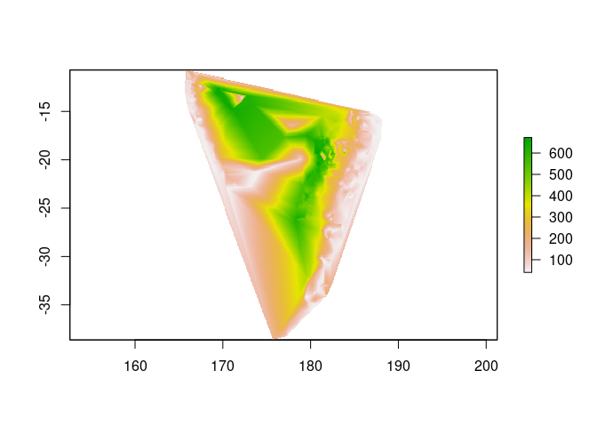
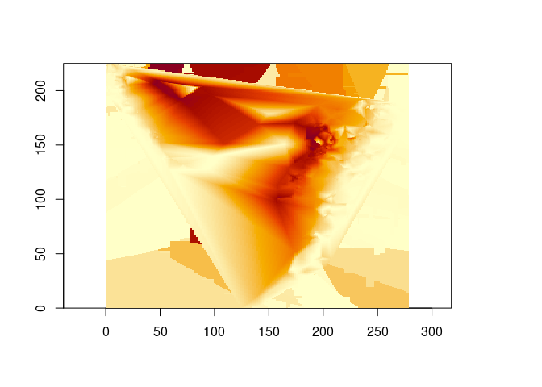

<!-- README.md is generated from README.Rmd. Please edit that file -->

# futility

<!-- badges: start -->
<!-- badges: end -->

The goal of futility is just a friendly wrapper around GDAL’s utility
libraries.

Examples include [gdal_grid](https://gdal.org/programs/gdal_grid.html)

## Installation

You can install the development version of futility from
[GitHub](https://github.com/) with:

``` r
# install.packages("devtools")
devtools::install_github("hypertidy/futility")
```

## Example

This is a basic example, compare to the triangulation interpolation in
the geometry package.

``` r
library(futility)
library(guerrilla)
xyz <- quakes[c("long", "lat", "depth")]
x1 <- tri_fun(xyz[,1:2], xyz[,3, drop = TRUE], 
              grid = raster::raster(raster::extent(range(xyz[,1]), range(xyz[,2])), res = .1))
library(raster)
#> Loading required package: sp
plot(x1)         
```



``` r
x0 <- gdal_grid(xyz, dimension = dim(x1)[2:1], extent = c(range(xyz[,1]), range(xyz[,2])))
#> [1] "/tmp/Rtmp2UK5Pw/file9972323c578f6.vrt"
#> Warning in CPL_gdalgrid(source, destination, options, oo, quiet): GDAL Message 1: Cannot open   <OGRVRTDataSource>
#>     <OGRVRTLayer name="znachluwpx997234651c0f8">
#>         <SrcLayer>znachluwpx997234651c0f8</SrcLayer>
#>         <SrcDataSource>/tmp/Rtmp2UK5Pw/znachluwpx997234651c0f8.csv</SrcDataSource>
#>         <GeometryType>wkbPoint</GeometryType>
#>         <LayerSRS>WGS84</LayerSRS>
#>         <GeometryField separator="," encoding="PointFromColumns" x="x" y="y" z="z"/>
#>     </OGRVRTLayer>
#> </OGRVRTDataSource>
ximage::ximage(x0, asp = 1)
```



I originally t wrote this as a way to check the timings, of the
disussion in this issue [‘Extreme performance regression in gdal_grid
with method linear’](https://github.com/OSGeo/gdal/issues/1879). Looks
like there’s a problem with results outside the convex hull ….

## Code of Conduct

Please note that the futility project is released with a [Contributor
Code of
Conduct](https://contributor-covenant.org/version/2/1/CODE_OF_CONDUCT.html).
By contributing to this project, you agree to abide by its terms.
